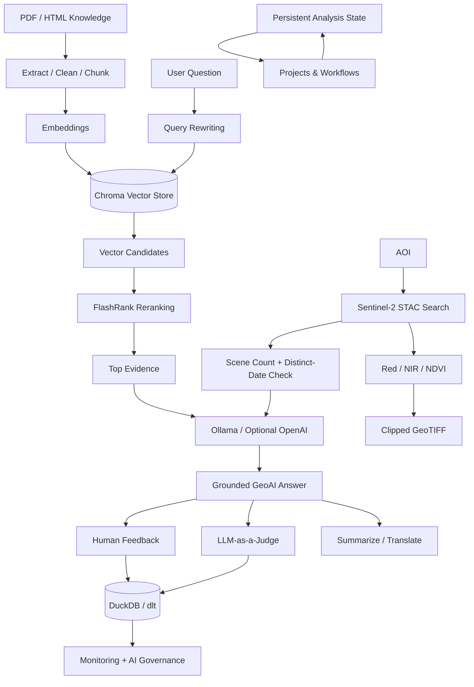

# GeoScope Agent

> **GeoScope helps Earth Observation researchers understand how AI can support their workflows — without replacing domain expertise.**

GeoScope Agent is an **AI-assisted Earth Observation application** developed as a capstone project for the **LLM Zoomcamp**.

It combines technical-document retrieval, geographic context, live Sentinel-2 catalogue search, raster processing, evaluation, human feedback, monitoring, AI governance, persistent analysis workflows, and a comparison between fixed and agentic orchestration.


---

## 👀 Note to Reviewer

GeoScope is implemented as a **Streamlit application rather than a notebook** so the complete workflow can be reviewed interactively.

### Recommended review path

**AOI & STAC** → **Ask GeoAI** → **Evaluation** → **Monitoring / AI Governance** → **Projects & Workflows** → **Pipeline vs Agentic**

For a quick review:

1. Start Ollama and the required models.
2. Define or load an AOI.
3. Search Sentinel-2 scenes.
4. Open **Ask GeoAI** and select **Rewrite + Rerank**.
5. Inspect the rewritten query, ranking changes, retrieved evidence, and grounded answer.
6. Give human feedback.
7. Review **LLM-as-a-judge** and **AI Governance**.
8. Open **Pipeline vs Agentic** and compare both orchestration patterns.

> **Docker support is included for reproducibility.**  
> The **Ollama Cloud** page is an isolated deployment/integration test and is **not required** for the normal local workflow.

---

## 🎯 1. Project Objective

Earth Observation researchers often need to answer several connected questions:

- Which **sensor or dataset** is appropriate for a task?
- Which **spectral bands or indices** are relevant?
- Are suitable scenes available for a selected **location and period**?
- Do several STAC items represent **different dates**, or only several tiles from the same date?
- Can a recommendation be translated into an executable **raster product**?
- How can AI help without hiding the evidence or replacing domain expertise?

A conventional chatbot may answer a technical question without checking the real geographic context or the actual satellite catalogue.

GeoScope connects:

**Technical knowledge + AOI + live STAC catalogue + retrieval + LLM generation + geospatial processing + evaluation + governance**

The objective is **not to replace remote-sensing expertise**. GeoScope demonstrates how AI can assist with knowledge retrieval, imagery discovery, grounded recommendations, simple raster processing, evaluation, and traceable analytical workflows.

---

## 🖥️ 2. Why Streamlit Instead of Notebooks?

GeoScope is intentionally implemented as a **multipage Streamlit application** rather than a collection of Jupyter notebooks.

| Notebook-style prototype | GeoScope Streamlit application |
|---|---|
| Code-centric | User-centric |
| Cell-by-cell execution | End-to-end workflow |
| Excellent for experimentation | Better for demonstration and evaluation |
| Temporary notebook state | Persistent workflow state |
| Limited operational view | Monitoring and governance |
| Harder to package | Docker-ready |

This makes the project easier to **use, demonstrate, evaluate, containerize, and eventually deploy**.

---

## 🧭 3. Understanding the Application

GeoScope is designed as an **interactive workflow**, not as a single chatbot screen.

### 3.1 Main application flow

```text
Data Preparation
      ↓
AOI & STAC
      ↓
Ask GeoAI
      ↓
Evaluation & Feedback
      ↓
Monitoring & AI Governance
      ↓
Projects & Workflows
      ↓
Pipeline vs Agentic
```

### 3.2 Application pages

| Page | What the user can do |
|---|---|
| **1 — Data Preparation** | Ingest PDF/HTML knowledge, clean and chunk text, create embeddings, and build the Chroma vector index. |
| **2 — AOI & STAC** | Define an AOI, search live Sentinel-2 scenes, inspect distinct acquisition dates, and generate GeoTIFF outputs. |
| **3 — Ask GeoAI** | Ask EO questions, choose a retrieval strategy, inspect evidence/ranks, generate a grounded answer, give feedback, summarize, or translate. |
| **4 — Evaluation & Feedback** | Compare retrieval strategies with Hit Rate/MRR and evaluate generated answers with an LLM-as-a-judge. |
| **5 — Monitoring** | Review runs, quality signals, feedback, traceability, and AI-governance indicators. |
| **6 — Automated Demo** | Run a prepared end-to-end scenario for demonstration. |
| **7 — Projects & Workflows** | Save, resume, complete, and archive persistent GeoScope projects. |
| **8 — Cloud Deployment Test** | Test Ollama Cloud as an optional remote inference provider. |
| **9 — Pipeline vs Agentic** | Compare a fixed LangChain pipeline with a bounded LangGraph agentic workflow. |

---

## 🏗️ 4. Architecture

GitHub renders the following Mermaid diagram directly in the README:



### Main technology components

- **Streamlit** — user interface
- **Chroma** — vector store
- **Ollama** — local LLM inference and embeddings
- **FlashRank** — reranking
- **Earth Search STAC** — live Sentinel-2 catalogue
- **Rasterio** — GeoTIFF processing
- **DuckDB + dlt** — logging, monitoring, evaluation history
- **LangChain** — fixed pipeline orchestration
- **LangGraph** — bounded agentic orchestration

---

## 🔎 5. Retrieval Approaches

GeoScope implements **four real retrieval pipelines**.

| Approach | Flow | Purpose |
|---|---|---|
| **Vector** | Original query → Chroma | Semantic baseline |
| **Rewrite** | Rewritten query → Chroma | Improve retrieval wording |
| **Rerank** | Original query → Chroma candidates → FlashRank | Improve candidate ordering |
| **Rewrite + Rerank** | Rewrite → Chroma candidates → FlashRank | Full advanced retrieval pipeline |

### What the user can inspect

The **Ask GeoAI** page exposes:

- **Original retrieval input**
- **Rewritten query**
- **Vector rank**
- **Final rank**
- **Vector distance**
- **FlashRank score**
- **Retrieved source text**

This supports **transparency and explainability**: the user can inspect how evidence was selected before the LLM generates the answer.

---

## 🌍 6. Earth Observation Integration

### 6.1 AOI and Sentinel-2 STAC search

The user can:

- draw an **Area of Interest (AOI)** on the map;
- search by place name;
- select a date range;
- filter by cloud cover;
- query live Sentinel-2 Level-2A scenes.

### 6.2 Important temporal guardrail

> **STAC scene items ≠ distinct acquisition dates**

Several scene items may represent different tiles from the **same day**.

GeoScope therefore counts **distinct acquisition dates** before recommending time-series analysis.

### 6.3 GeoTIFF processing

A **GeoTIFF** is a raster image that stores both pixel values and geographic reference information.

GeoScope can export a selected Sentinel-2 scene as:

- **Red**
- **NIR**
- **NDVI**

Workflow:

**Selected STAC scene** → **Choose Red/NIR/NDVI** → **Clip to AOI** → **Generate GeoTIFF** → **Open in QGIS/ArcGIS**

**Current scope:** one AOI + one selected scene + one product → one clipped GeoTIFF.

> GeoScope does not yet implement a complete production remote-sensing chain such as multi-tile mosaicking, full cloud masking, or aligned multi-date raster cubes.

---

## 🤖 7. Models Used

GeoScope uses **Ollama locally by default**.

| Role | Model |
|---|---|
| **Generation** | `qwen2.5:7b-instruct` |
| **Query rewriting** | `qwen2.5:7b-instruct` |
| **Embeddings** | `nomic-embed-text` |
| **LLM-as-a-judge** | `llama3.1:8b` |

The separation is intentional:

- the **generation model** produces user-facing answers;
- the **embedding model** powers semantic retrieval;
- the **judge model** evaluates generated answers independently.

---

## 📊 8. Evaluation and Human Feedback

### 8.1 Retrieval evaluation

Ground-truth questions:

`data/evaluation_questions.csv`

Metrics:

- **Hit Rate**
- **Mean Reciprocal Rank (MRR)**

The same ground truth is evaluated across all four retrieval approaches.

### 8.2 LLM-as-a-judge

Generation evaluation includes:

- **Relevance**
- **Groundedness**
- **Completeness**
- **Technical correctness**
- **Citation quality**
- **Geographic relevance**
- **Overall assessment**

### 8.3 Human feedback

Human feedback is collected directly in **Ask GeoAI**:

- 👍 **Yes**
- 👎 **No**
- optional written comment

Feedback and evaluation records are persisted and surfaced in Monitoring.

---

## 🛡️ 9. Monitoring and AI Governance

GeoScope treats governance as part of the **operational workflow**, not as a separate policy document.

| Governance dimension | How GeoScope addresses it |
|---|---|
| **Groundedness** | RAG evidence + groundedness evaluation |
| **Explainability** | Visible query rewrite, ranks, reranking scores, and sources |
| **Transparency** | Provider, model, retrieval strategy, context, and limitations are visible |
| **Human oversight** | Feedback and validation at the point of use |
| **Reliability / quality** | Retrieval metrics + LLM-as-a-judge |
| **Traceability / auditability** | DuckDB/dlt logs + persistent workflow history |
| **Responsible use** | Evidence-backed answers, geographic context, temporal checks, and human validation |

GeoScope primarily uses **public Earth Observation and technical data** and does not perform individual profiling or demographic decision-making.

The main risks are instead:

- unsupported geospatial conclusions;
- misleading temporal interpretation;
- overconfidence;
- hallucinated technical claims;
- missing evidence.

---

## ✍️ 10. Summarize and Translate

After a grounded answer is generated, the user can optionally:

- **Summarize**
- **Translate**
- **Summarize + Translate**

Supported UI choices currently include:

**English · French · Arabic · Spanish · German**

This is **post-processing of the existing grounded answer**. Retrieval is **not rerun**, and the original answer remains visible.

---

## 📂 11. Persistent Projects and Workflows

GeoScope can persist analytical workflow state in DuckDB.

Example:

| Step | Example status |
|---|---|
| AOI defined | ✅ Completed |
| STAC search | ✅ Completed |
| Knowledge retrieval | ✅ Completed |
| GeoAI recommendation | ✅ Completed |
| GeoTIFF processing | ▶ In progress |
| Evaluation | ○ Pending |
| Completion | ○ Pending |

Projects can be:

- **Created**
- **Saved**
- **Resumed**
- **Completed**
- **Archived**

Persisted state can include AOI, dates, STAC results, questions, retrieval strategy, sources, answers, GeoTIFF metadata, evaluation, artifacts, and event history.

> This makes GeoScope a **stateful analytical assistant**, not only a stateless chatbot.

---

## 🔀 12. Fixed Pipeline vs Agentic AI

### Fixed LangChain pipeline

**Question** → **Rewrite** → **Retrieve** → **Rerank** → **Build context** → **Generate**

Use this when the required steps are **known and repeatable**.

### Agentic LangGraph workflow

**Question** → **Planner** → **Choose bounded tool** → **Observe** → **Planner** → **Next action** → **Answer**

The planner can choose among bounded actions such as:

- inspect current geographic context;
- search STAC;
- retrieve technical knowledge;
- generate the final answer.

> **Key takeaway:** Not every use case requires Agentic AI.  
> Use the simplest orchestration pattern that solves the task.

---

## 🗂️ 13. Project Structure

Rather than displaying the whole repository as one long line, the main structure is grouped by purpose:

```text
GeoScope_Agent/
│
├── GeoScope.py                         # Streamlit entry point
│
├── pages/                              # Application pages
│   ├── 1_Data_Preparation.py
│   ├── 2_AOI_and_STAC.py
│   ├── 3_Ask_GeoAI.py
│   ├── 4_Evaluation_and_Feedback.py
│   ├── 5_Monitoring.py
│   ├── 6_Automated_Demo.py
│   ├── 7_Projects_and_Workflows.py
│   ├── 8_Cloud_Deployment_Test.py
│   └── 9_Pipeline_vs_Agentic.py
│
├── src/                                # Core application logic
│   ├── ingest_documents.py
│   ├── build_vector_index.py
│   ├── retrieval.py
│   ├── query_rewrite.py
│   ├── reranking.py
│   ├── generation.py
│   ├── llm_provider.py
│   ├── stac_search.py
│   ├── geotiff_processing.py
│   ├── evaluation.py
│   ├── monitoring.py
│   ├── dlt_logging.py
│   ├── workflow_store.py
│   ├── langchain_pipeline.py
│   └── agentic_geoscope.py
│
├── data/
│   ├── evaluation_questions.csv
│   └── demo/
│
├── documentation/
│   ├── USER_GUIDE.md
│   └── images/
│       └── earth_observation_context_egypt.jpeg
│
├── Dockerfile
├── docker-compose.yml
├── .dockerignore
├── requirements.txt
└── README.md
```

Runtime files such as Chroma indexes, workflow DuckDB files, logs, secrets, and the FlashRank model cache should **not** be committed.

---

## ⚙️ 14. Local Installation

### 14.1 Prerequisites

- **Python 3.11**
- **Ollama**
- Internet access for Earth Search STAC and optional Nominatim place search
- FlashRank model available locally or downloadable

### 14.2 Clone and create the environment

```cmd
git clone <YOUR_REPOSITORY_URL>
cd GeoScope_Agent

py -3.11 -m venv .venv
.venv\Scripts\activate

python -m pip install --upgrade pip
python -m pip install -r requirements.txt
```

### 14.3 Install Ollama models

```cmd
ollama pull qwen2.5:7b-instruct
ollama pull nomic-embed-text
ollama pull llama3.1:8b
```

Start Ollama if necessary:

```cmd
ollama serve
```

Default endpoint:

```text
http://localhost:11434
```

### 14.4 Streamlit configuration

Create:

```text
.streamlit/secrets.toml
```

Example:

```toml
GEOSCOPE_PROVIDER = "ollama"
OLLAMA_GENERATION_MODEL = "qwen2.5:7b-instruct"
OLLAMA_JUDGE_MODEL = "llama3.1:8b"
```

> **Never commit `secrets.toml`.**

### 14.5 Run GeoScope

```cmd
python -m streamlit run GeoScope.py
```

Open:

`http://localhost:8501`

---

## 🧮 15. FlashRank Model

GeoScope uses:

`ms-marco-MiniLM-L-12-v2`

The local model cache is intentionally excluded from Git:

```gitignore
data/flashrank_cache/
```

---

## 🐳 16. Docker

GeoScope is containerized.

The application container does **not** need to contain the Ollama models.

On Windows with Docker Desktop, the container can call Ollama running on the host through:

`http://host.docker.internal:11434`

Start:

```cmd
docker compose up --build
```

Open:

`http://localhost:8501`

For active development, running Streamlit directly is faster. Docker is mainly used to validate **reproducibility and packaging**.

---

## ☁️ 17. Ollama Cloud / Streamlit Community Cloud

Page **8 — Cloud Deployment Test** is intentionally isolated from the normal local runtime.

Correct terminology:

> **GeoScope is deployed on Streamlit Community Cloud and uses Ollama Cloud for remote model inference.**

The page can test:

- API authentication;
- cloud model discovery;
- generation;
- query-rewrite / judge suitability;
- embeddings;
- vector-index compatibility considerations.

This is an **optional deployment test**, not the default GeoScope runtime.

---

## 🚀 18. Quick Start for Reviewers

1. Start Ollama and the required models.
2. Run `python -m streamlit run GeoScope.py`.
3. Open **Data Preparation** and confirm/build the knowledge index.
4. Open **AOI & STAC**.
5. Draw an AOI or search `Kom Ombo, Aswan, Egypt`.
6. Select a historical date range and cloud threshold.
7. Search Sentinel-2 and inspect **distinct acquisition dates**.
8. Optionally generate **Red, NIR, or NDVI GeoTIFF**.
9. Open **Ask GeoAI**.
10. Select **Rewrite + Rerank**.
11. Ask a technical EO question.
12. Inspect the rewritten query, ranks, reranking score, evidence, and answer.
13. Give human feedback.
14. Optionally summarize or translate.
15. Open **Evaluation & Feedback**.
16. Open **Monitoring → AI Governance**.
17. Open **Projects & Workflows**.
18. Open **Pipeline vs Agentic** and compare both approaches.

For a shorter path, use **Automated Demo**.

---

## ⚠️ 19. Current Limitations

- No multi-tile mosaicking
- No full cloud-mask raster workflow
- No aligned multi-date raster cube
- No scheduled ingestion orchestration
- Automated raster access depends on network connectivity
- Query rewriting and reranking increase evaluation runtime
- Ollama Cloud page is a deployment/integration test, not the default runtime
- The agent is deliberately bounded and is not a fully autonomous EO system

---

## 🔐 20. Security and Git Hygiene

Keep the following outside Git:

```gitignore
.venv/
__pycache__/
*.pyc
.streamlit/secrets.toml
.env
logs/*.duckdb
data/vector_store/
data/flashrank_cache/
data/geoscope_workflows.duckdb
```

---

## ✅ 21. Rubric Coverage

| Criterion | GeoScope implementation |
|---|---|
| **Dataset / source** | Technical documents + live Earth Search STAC |
| **Ingestion / API** | PDF/HTML ingestion + STAC API |
| **Application flow** | Retrieval → context → prompt → LLM + geospatial tools |
| **Retrieval evaluation** | Hit Rate + MRR |
| **LLM evaluation** | LLM-as-a-judge |
| **Human feedback** | 👍 / 👎 + comments |
| **Interface** | Streamlit multipage application |
| **Monitoring** | DuckDB/dlt + Streamlit dashboard |
| **Advanced retrieval** | Query rewriting + FlashRank reranking |
| **Multiple retrieval approaches** | Four pipelines |
| **Geospatial processing** | AOI + STAC + NDVI + GeoTIFF |
| **Persistence** | Projects & Workflows |
| **AI governance** | Explainability, transparency, oversight, traceability, quality |
| **Agentic AI** | Bounded LangGraph workflow |
| **Framework orchestration** | LangChain fixed pipeline |
| **Containerization** | Docker + Docker Compose |
| **Reproducibility** | README + User Guide + requirements + configuration |

---

## 📖 22. Detailed User Guide

For the full page-by-page instructions, see:

**[documentation/USER_GUIDE.md](documentation/USER_GUIDE.md)**
